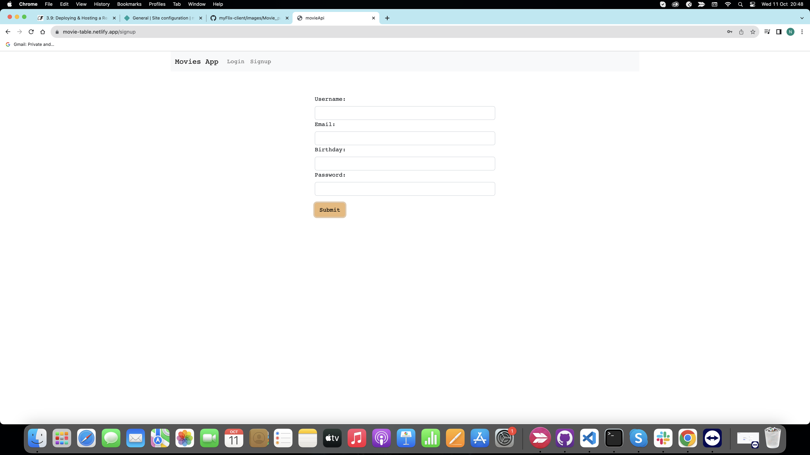
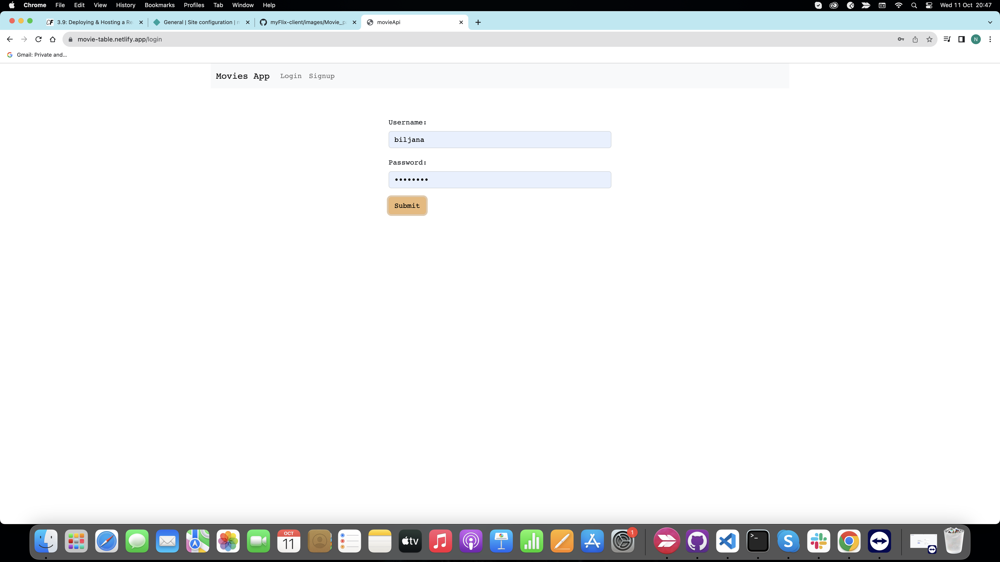
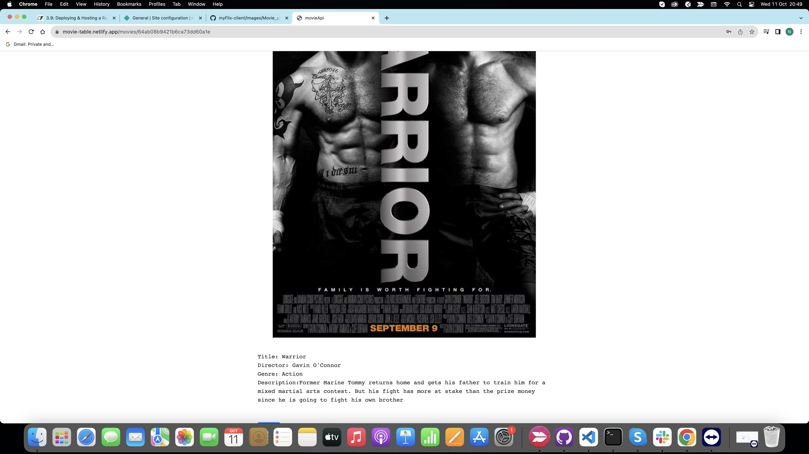

# movieApi-client

Front end built with React framework.

App is built for learning React and libraries directed by the [Career Foundry](https://careerfoundry.com/) Coding Bootcamp.

App shows CRUD functionality with Mongo Database. Users are able to sign up, login and view movies.

You can visit my app on [movieApi](https:// movie-table.netlify.app)

## Build Process

Build process is utalizing Parcel. To create build run parcel [Path to index.html]
Example: from project directory run - parcel src/index.html

## Site Screenshots

